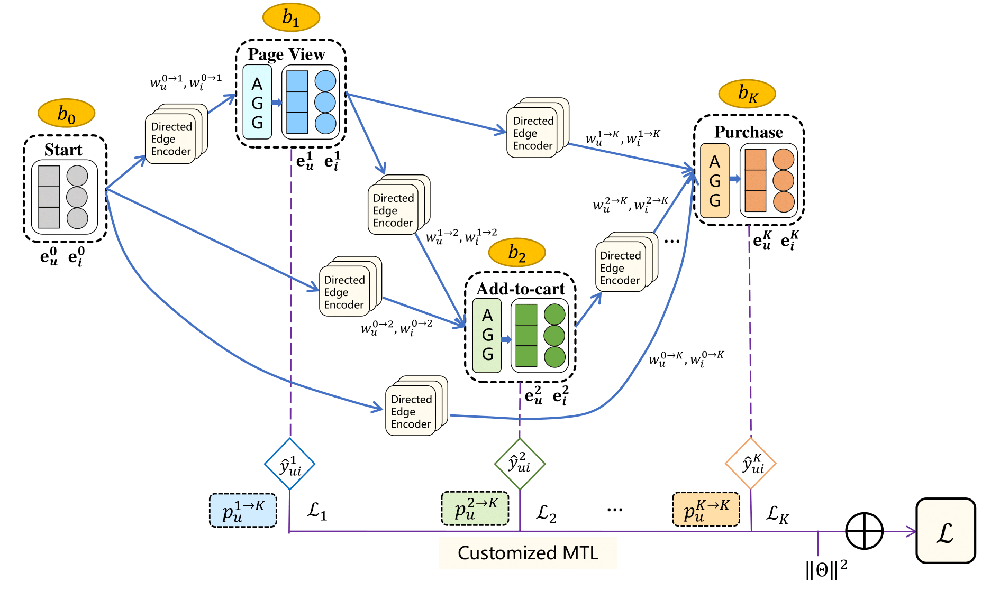
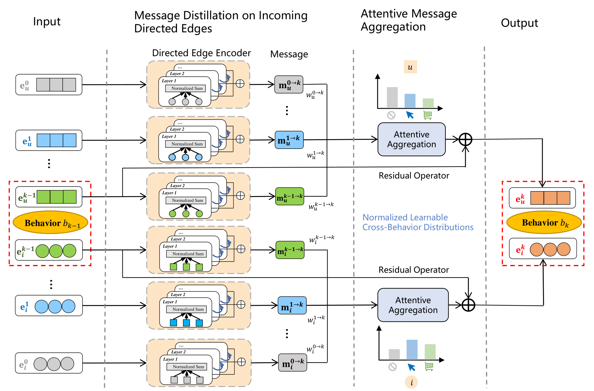
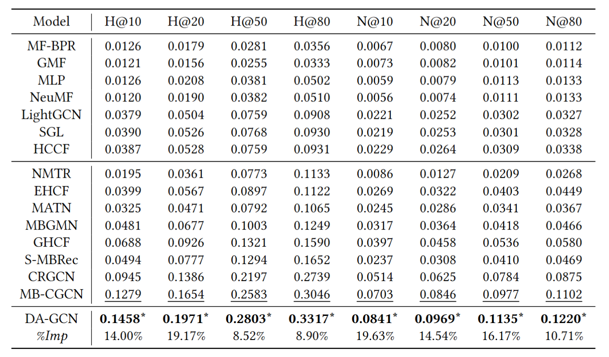
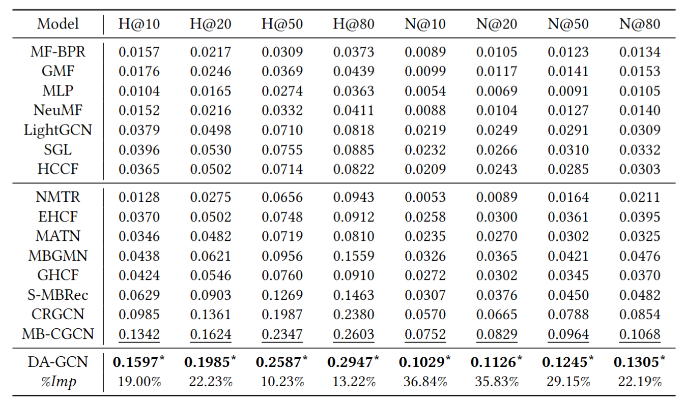
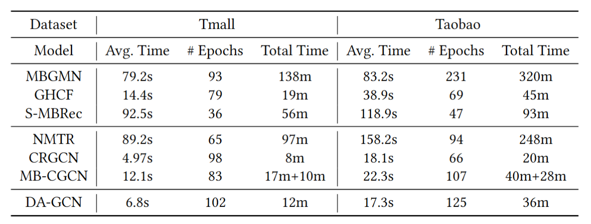

# 🚀 Multi-Behavior Recommendation with Personalized Directed Acyclic Behavior Graphs


## 🔎 Overview

This repository contains the code implementation for **[*Multi-Behavior Recommendation with Personalized Directed Acyclic Behavior Graphs*](https://dl.acm.org/doi/10.1145/3696417)**, published in **ACM Transaction on Information System (ACM TOIS)**.

We propose a novel **Directed Acyclic Graph Convolutional Network (DA-GCN)** for the multi-behavior recommendation task. 

To the best of our knowledge, we are the first to extend the monotonic behavior chain to personalized directed acyclic behavior graphs to exploit behavior dependencies, which can reveal the personalized interactive patterns of users and the inherent nature of items simultaneously.

## 🔑 Key Features of DA-GCN 


**Methodology**

- The overall framework of the proposed DA-GCN framework. We pinpoint the partial order relations within the monotonic behavior chain and extend it to personalized directed acyclic behavior graphs to exploit behavior dependencies. Then, a GCN-based directed edge encoder is employed to distill rich collaborative signals embodied by each directed edge. In light of the information flows over the directed acyclic structure, we propose an attentive aggregation module to gather messages from all potential antecedent behaviors, representing distinct perspectives to understand the terminated behavior. Thus, we obtain comprehensive representations for the follow-up behavior through learnable distributions over its preceding behaviors, explicitly reflecting personalized interactive patterns of users and underlying properties of items simultaneously. Finally, we design a customized multi-task learning objective for flexible joint optimization.


- The illustration of behavior-wise embedding update between two adjacent behaviors within the behavior chain, which is composed of a message distillation module and a message aggregation module.


**Experiments**

- The overall performance in terms of HR@K and NDCG@K on the Tmall dataset.


- The overall performance in terms of HR@K and NDCG@K on the Taobao dataset.


- Comparisons of runtime (second/minute [s/m]) with selected cascade models (MBGMN, GHCF, and S-MBRec) and parallel models (NMTR, CRGCN, and MB-CGCN), including the average training time for each epoch (Avg. Time), the number of epochs to converge (# Epochs), and the total training time (Total Time). 


## 📊 Dataset
The datasets are available at `./data`. The **Tmall** dataset aligns with MB-CGCN, and the **Taobao** dataset is shared with EHCF and GHCF, especially data splits for fair comparison.

For each dataset, we include the following files: 
- a. the numbers of users and items, i.e. `count.txt`.
- b. the interactions of all behaviors in the training set, e,g., `pv_dict.txt`, `cart_dict.txt`, and `buy_dict.txt`. 
- c. the interactions of the target behavior for validation, i.e. `validation_dict.txt`.
- d. the interactions of the target behavior for testing, i.e. `test_dict.txt`.

You can easily train our DA-GCN model on your own dataset by the provided format.


## ⚙️ Implementation

- Set up a new environment with the following requirements. 
    ```
    python==3.8.20
    torch==1.12.0+cu116
    loguru==0.7.2
    numpy==1.24.4
    scipy==1.10.1
    scikit-learn==1.3.2s
    tqdm==4.66.5
    tensorboard==2.17.1
    setuptools==58.0.4
    ```
   
- Train the DA-GCN model with specific hyper-parameters.
    - For the Tmall dataset:
    ```
    python main.py --if_layer_norm --if_multi_task --mtl_type personalized --data_name tmall --batch_size 1024 --aux_weight 0.8 --gpu 1
    ```
    - For the Taobao dataset: 
    ```
    python main.py --if_layer_norm --if_multi_task --mtl_type personalized --data_name taobao --batch_size 2048 --aux_weight 0.8 --gpu 1
    ```
- If you need to load existing models, add `--if_load_model` to the command and specify the checkpoint file by its timestamp using `--checkpoint`.

- Check the results.
    - Logging files: check `./log` and select the folder named by timestamp. 
    - Checkpoint files: check `./checkpoint` and select the folder named by its timestamp, and access `model.pth` and `all_embeddings.pth`.

## 📖 Citation
```
@article{zhu2024multi,
  title={Multi-Behavior Recommendation with Personalized Directed Acyclic Behavior Graphs},
  author={Zhu, Xi and Lin, Fake and Zhao, Ziwei and Xu, Tong and Zhao, Xiangyu and Yin, Zikai and Li, Xueying and Chen, Enhong},
  journal={ACM Transactions on Information Systems},
  year={2024},
  publisher={ACM New York, NY}
}
```

## 📬 Contact
If you have any questions, please contact [Xi Zhu](mailto:xi.zhu@rutgers.edu).
